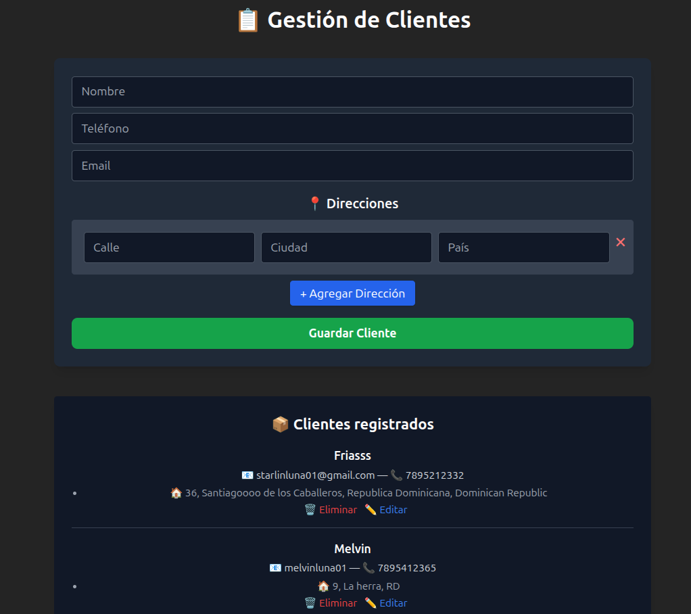

# 🧩 Oriontek - Gestión de Clientes

Proyecto completo para la **gestión de clientes y direcciones**, desarrollado con un enfoque fullstack: backend en **Java + Spring Boot**, frontend en **Vue 3 + Tailwind**, y base de datos **PostgreSQL**. Todo el sistema es desplegable con **Docker Compose**.

---

## 📦 Tecnologías Usadas

### Backend:
- Java 17
- Spring Boot
- Spring Data JPA
- PostgreSQL
- Swagger/OpenAPI (springdoc)
- Validaciones con Jakarta Bean Validation
- JUnit (para testing)

### Frontend:
- Vue 3 (Composition API)
- Tailwind CSS
- Axios
- Vite

### Infraestructura:
- Docker
- Docker Compose

---

## ⚙️ Estructura del Proyecto

```
oriontek-clientes/
├── backend/             # API REST Java Spring Boot
├── frontend/            # Aplicación Vue 3
├── docker-compose.yml   # Orquestación completa del stack
└── README.md
```

---

## 🚀 Cómo ejecutar el proyecto

### Requisitos:
- Docker y Docker Compose instalados

### 1. Clona el repositorio

```bash
git clone https://github.com/tuusuario/oriontek-clientes.git
cd oriontek-clientes
```

### 2. Levanta el stack completo

```bash
docker-compose up --build
```

### 3. Accede a los servicios

| Servicio       | URL                                         |
|----------------|---------------------------------------------|
| Frontend (Vue) | http://localhost:5173                       |
| Backend (API)  | http://localhost:8080/api/clientes          |
| Swagger Docs   | http://localhost:8080/swagger-ui.html       |
| Base de datos  | PostgreSQL en puerto `5432` (usuario: `postgres`) |

---

## 📖 Endpoints disponibles

| Método | Endpoint                          | Descripción                    |
|--------|-----------------------------------|--------------------------------|
| GET    | `/api/clientes`                  | Listar todos los clientes      |
| GET    | `/api/clientes/{id}`             | Obtener cliente por ID         |
| POST   | `/api/clientes`                  | Crear un nuevo cliente         |
| PUT    | `/api/clientes/{id}`             | Editar cliente y direcciones   |
| DELETE | `/api/clientes/{id}`             | Eliminar cliente completo      |
| DELETE | `/api/clientes/{id}/direcciones/{id}` | Eliminar dirección específica |

---

## 🧪 Validaciones de entrada

El backend incluye validaciones como:

- Nombre, email y teléfono obligatorios
- Teléfono debe tener 10 dígitos
- Al menos una dirección requerida

Los errores son enviados con códigos HTTP adecuados y mensajes legibles para el frontend.

---

## 🖼️ Capturas



---

## 👨‍💻 Autor

Desarrollado por **Starlin Luna**.  
📧 Contacto: [starlinluna0102@gmail.com](mailto:starlinluna0102@gmail.com)
